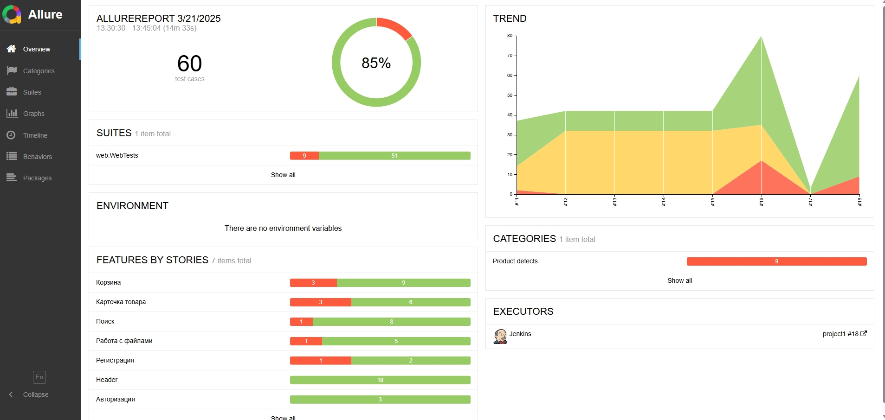
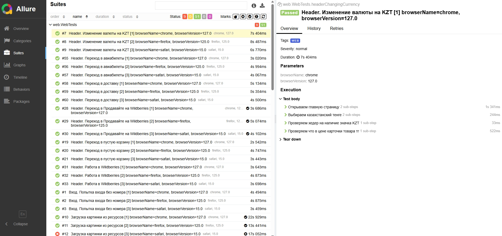
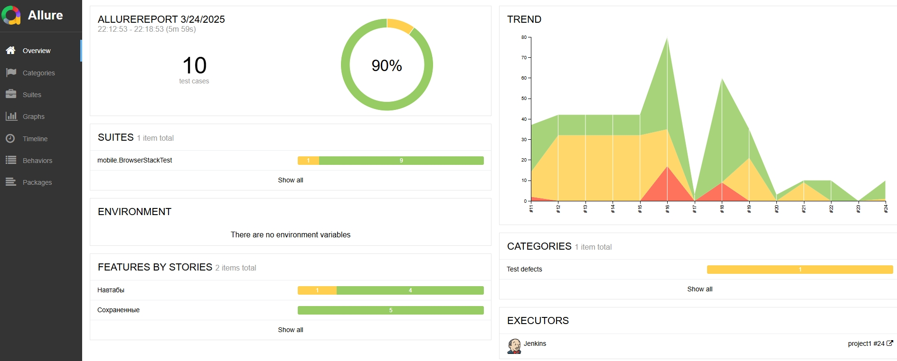
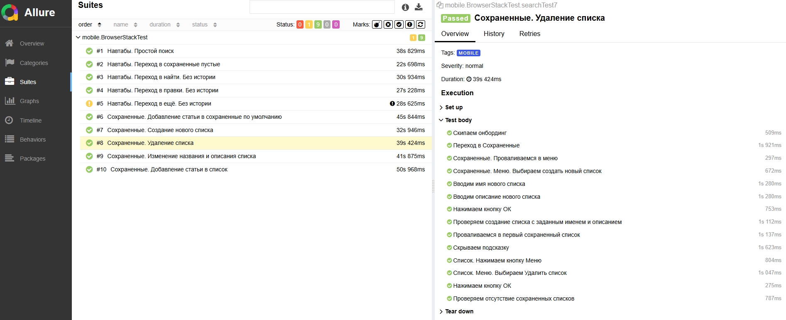
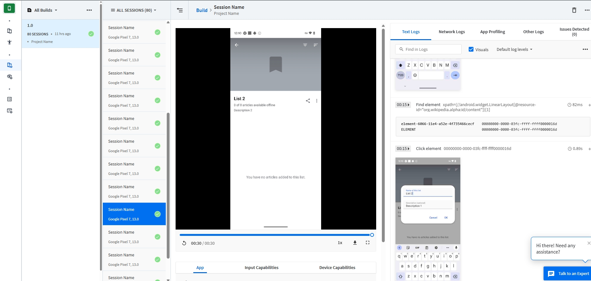
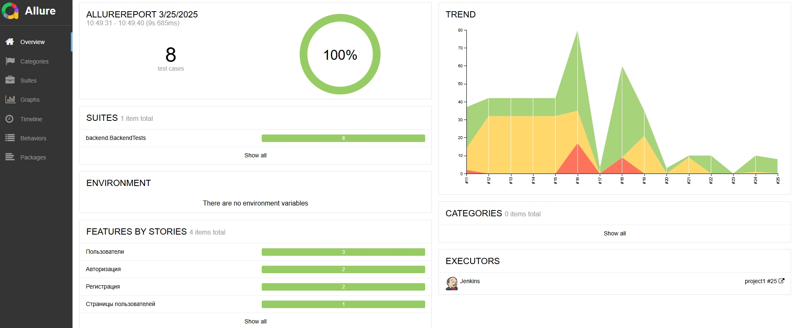
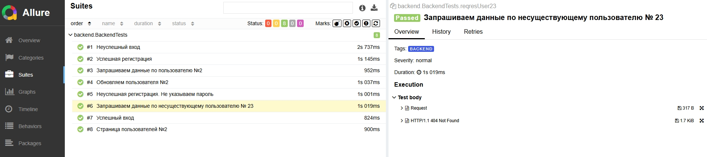

## Проект по автоматизации тестирования (Web UI, Mobile UI, Backend)

## :maple_leaf: Содержание:

* <b><a href="#tools">Технологии и инструменты</a></b>
* <b><a href="#web">Web UI</a></b>
* <a href="#casesweb">- Список проверок, реализованных в тестах</a>
* <a href="#webavto">- Подходы к автоматизации</a>
* <a href="#environment">- Окружение</a>
* <a href="#allweb">- Allure-отчет</a>
* <a href="#videoweb">- Видео прохождения тестов</a>
* <b><a href="#mob">Mobile UI</a></b>
* <a href="#casesmob">  - Список проверок, реализованных в тестах</a>
* <a href="#mobavto">  - Подходы к автоматизации</a>
* <a href="#allmob">  - Allure-отчет</a>
* <a href="#videomob">  - Видео прохождения тестов</a>
* <b><a href="#back">Backend</a></b>
* <a href="#casesback">  - Список проверок, реализованных в тестах</a>
* <a href="#backavto">  - Подходы к автоматизации</a>
* <a href="#allback">  - Allure-отчет</a>
    

## :maple_leaf: Технологии и инструменты

 
 

`Java` - язык программирования. \
`Gradle` - используется как инструмент автоматизации сборки.  \
`JUnit5` - для выполнения тестов.\
`REST Assured` - для тестирования REST-API сервисов.\
`Jenkins` - CI/CD для запуска тестов удаленно.\
`Selenoid` - для удаленного запуска браузера в `Docker` контейнерах.\
`Android Studio tools`, `Appium`, `Appium Inspector`, `Vysor` - для запуска мобильных тестов локально на эмуляторе мобильных устройств.\
`Allure Report` - для визуализации результатов тестирования.\
`Browserstack` - запуск мобильных автотестов.\
`Ubuntu` - физический сервер для запуска автотестов.\
`Docker` - для запуска контейнеров на сервере.

# :maple_leaf: WEB UI
## :maple_leaf: Сайт для основных тестов

## :maple_leaf: Сайт для теста на заполнение формы регистрации

## :maple_leaf: Список проверок, реализованных в автотестах web

- [x] Авторизация. Проверка на пустой номер
- [x] Header. Изменения валюты. Переходы по вкладкам. 
- [x] Поиск. По тексу, по фото, неккоректный поиск
- [x] Карточка товара. Переход в отзывы. Переход в характеристики.
- [x] Корзина. Уменьшение количества товара, увеличение количества товара, переход на главную, удаление товара
- [x] Работа с файлами. Загрузка и скачивание 
- [x] Регистрация. Заполнение формы

## :maple_leaf: Подходы к автоматизации

- [x] Лямбда-степы. Использование лямбда-выражений для создания тестовых шагов позволило создать более чистый и понятный код. 
- [x] Генерация тестовых данных с помощью Java Faker. Для заполнения формы регистрации использовалась библиотека Java Faker, генерирующая реалистичные тестовые данные.
- [x] Кроссбраузерное тестирование с @ParameterizedTest. Использование аннотации @ParameterizedTest позволило автоматизировать тестирование на различных браузерах. Каждый тест прогоняется на последних версиях chrome, firefox и safari.
- [x] Работа с файлами. Реализована функциональность работы с файлами. Загрузка, скачивание и проверка корректности.

## :maple_leaf: Окружение
- [x] GitHub, Jenkins, сервер на Ubuntu, Docker, Selenoid
- [x] Браузер Safari был также залит в Selenoid, что удобнее и дешевле тестов на маках

## </a> Отчет в  Allure report</a>

###  Главное окно

###  Тесты

## </a> Видео прохождения тестов

</a>

# :maple_leaf: MOBILE UI
## :maple_leaf: Приложение

## :maple_leaf: Список проверок, реализованных в автотестах mobile

- [x] Поиск
- [x] Переход в Сохраненные
- [x] Переход в Найти
- [x] Переход в Правки
- [x] Переход в Ещё
- [x] Добавление статьи в список по умолчанию
- [x] Создание нового списка
- [x] Удаление списка
- [x] Изменение названия и описания списка
- [x] Добавление статьи в пользовательский список

## :maple_leaf: Подходы к автоматизации

- [x] Степы. Использование аннотации step в page object. 
- [x] Browserstack. Тесты запускаются в облачной платформе с возможностью выбора мобильного устройства.

## </a> Отчет в  Allure report</a>
###  Главное окно

###  Тесты

###  Browserstack

## </a> Видео прохождения мобильных тестов

</a>

# :maple_leaf: BACKEND
## :maple_leaf: Сайт

## :maple_leaf: Список проверок, реализованных в автотестах backend

- [x] Успешная регистрация
- [x] Неуспешная регистрация. Не указываем пароль
- [x] Успешный вход
- [x] Неуспешный вход
- [x] Получение данных со страницы пользователей №2
- [x] Запрашиваем данные по пользователю №2
- [x] Запрашиваем данные по несуществующему пользователю № 23
- [x] Обновляем пользователя №2

## :maple_leaf: Подходы к автоматизации

- [x] Lombok. Bспользуется для сокращения количества шаблонного кода.

## </a> Отчет в  Allure report</a>
###  Главное окно

###  Тесты

[Вернуться к оглавлению ⬆](#Ссылка)
